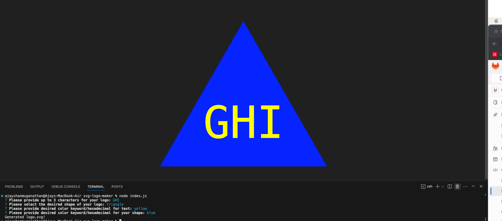

# SVG Logo Maker 🔨

## Description
The purpose of this project is to create a Logo Maker that generates an SVG file following a user answering a series of prompts using node JS, Jest, Inquirer and Test-driven Development.

## Requirements
- Ensure user is prompted for text and can enter up to 3 characters
- Ensure user is prompted for and can enter text color keyword or hexadecimal number
- Ensure user is prompted for shape and can choose from list: circle, triangle and square
- Ensure user is prompted for and can enter shape color keyword or hexadecimal number
- Ensure once all prompts answered, logo.svg file is created

## Node Application Preview

## Submission Requirements
- [Video Walkthrough](https://drive.google.com/file/d/1aZ-6l4wSP4EAwRjEyxbZfWnp6mxItWTY/view)
- [Sample logo.svg](https://github.com/ajayshans/svg-logo-maker/blob/main/logo.svg)
- [GitHub Repo](https://github.com/ajayshans/svg-logo-maker)